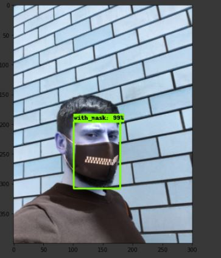
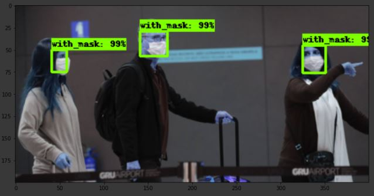

# Face-Mask-Detection-using-Object-Detection

 


## Business Objectives :

COVID-19 has affected the whole world very badly. It has a huge impact on our everyday life, and this crisis is increasing day by day. In the near future, it seems difficult to eradicate this virus completely. To counter this virus, Face Masks have become an integral part of our lives. These Masks are capable of stopping the spread of this deadly virus, which will help to control the spread. As we have started moving forward in this ‘new normal’ world, the necessity of the face mask has increased.

We are going to build a model that will be able to classify whether the person is wearing a mask or not. This model can be used in crowded areas like Malls, Bus stands, and other public places.

## Data Collection :

The dataset was obtained from Kaggle.

Link: https://www.kaggle.com/andrewmvd/face-mask-detection

With this dataset, it is possible to construct an object detection model to identify people wearing masks, not wearing them, or inappropriately wearing them. This dataset contains 853 images belonging to the 3 classes and their bounding boxes in the PASCAL VOC format. The classes are:
  - With mask
  - Without mask
  - Mask wore incorrectly.
  
## Modelling :

### Step 1: Set our TensorFlow1 Directory.
We will create a new folder directly in local disk C: and name it as “tensorflow1,” and then we will download the TensorFlow Object Detection API repository from GitHub (https://github.com/tensorflow/models). This “tensorflow1” will be our primary working directory, which will contain all the necessary files for our object detection framework.
After downloading the whole repository, we will extract it to our tensorflow1 folder and rename the “models-master” folder to “models.”

After that, we will download the EdjeElectronics/TensorFlow-Object-Detection-API-Tutorial-Train-Multiple-Objects-Windows-10. We will copy all the folders and files from this repository and replace them in our object detection folder: C:\tensorflow1\models\research\object_detection. 

### Step 2: Create an Anaconda Virtual Environment.
Check the Anaconda Prompt utility from the Start menu in Windows, right-click on it and click “Run as Administrator.” 
If you are asked by Windows if you want to allow it to make improvements to your device, please press Yes.
In the Anaconda prompt, create a new virtual environment named “tensorflow1.”

```
C:\> conda create -n tensorflow1 pip python=3.6
```

Then we will activate this virtual environment.

```
C:\> activate tensorflow1
```

```
(tensorflow1) C:\>python -m pip install --upgrade pip
```

Now we will install TensorFlow

```
(tensorflow1) C:\> pip install --ignore-installed --upgrade tensorflow
```

After this, we will install the necessary packages of python:

```
(tensorflow1) C:\> conda install -c anaconda protobuf
(tensorflow1) C:\> pip install pillow
(tensorflow1) C:\> pip install lxml
(tensorflow1) C:\> pip install jupyter
(tensorflow1) C:\> pip install matplotlib
(tensorflow1) C:\> pip install pandas
(tensorflow1) C:\> pip install opencv-python
```

After this, we will Configure the PYTHONPATH environment variable. PYTHONPATH is an environment variable. The PYTHONPATH variable has a value that is a string with a list of directories that Python should add to our directory.

```
(tensorflow1) C:\> set PYTHONPATH=C:\tensorflow1\models;C:\tensorflow1\models\research;C:\tensorflow1\models\research\slim
```
 Next, we need to compile the Protobuf scripts, which TensorFlow uses to configure parameters for our model and for training it. This generates the name_pb2.py file in the \object detection\protos folder from every name.proto file. But for this first, we will change the directory.
 
 ```
 (tensorflow1) C:\> cd C:\tensorflow1\models\research
 ```
 
 And then run the following command
 
 
 ```
 protoc --python_out=. .\object_detection\protos\anchor_generator.proto .\object_detection\protos\argmax_matcher.proto .\object_detection\protos\bipartite_matcher.proto .\object_detection\protos\box_coder.proto .\object_detection\protos\box_predictor.proto .\object_detection\protos\eval.proto .\object_detection\protos\faster_rcnn.proto .\object_detection\protos\faster_rcnn_box_coder.proto .\object_detection\protos\grid_anchor_generator.proto .\object_detection\protos\hyperparams.proto .\object_detection\protos\image_resizer.proto .\object_detection\protos\input_reader.proto .\object_detection\protos\losses.proto .\object_detection\protos\matcher.proto .\object_detection\protos\mean_stddev_box_coder.proto .\object_detection\protos\model.proto .\object_detection\protos\optimizer.proto .\object_detection\protos\pipeline.proto .\object_detection\protos\post_processing.proto .\object_detection\protos\preprocessor.proto .\object_detection\protos\region_similarity_calculator.proto .\object_detection\protos\square_box_coder.proto .\object_detection\protos\ssd.proto .\object_detection\protos\ssd_anchor_generator.proto .\object_detection\protos\string_int_label_map.proto .\object_detection\protos\train.proto .\object_detection\protos\keypoint_box_coder.proto .\object_detection\protos\multiscale_anchor_generator.proto .\object_detection\protos\graph_rewriter.proto .\object_detection\protos\calibration.proto .\object_detection\protos\flexible_grid_anchor_generator.proto
 ```
 
 Now finally, we will run the following to commands from the C:\tensorflow1\models\research.  The build command is used for putting all the files to install into the build directory.
 
 The TensorFlow Object Detection API is now fully configured to use pre-trained object detection models or train new models.
 
 ### Step 3: Customize particular files according to our dataset.
 
In this step, we will customize and tweak a few files in order to successfully run this objection detection task to identify facemask specifically. 
 
At first we will edit the file named xml_to_csv.py. From line number 17 to 20 we will change int(member[4][0].text) to int(member[5][0].text)

Now in the training folder (C:\tensorflow1\models\research\object_detection\training), we will delete all the pre-existing files and create a new file named labelmap.pbtxt. We will insert the following script in the labelmap file.

```
item {
  id: 1
  name: 'with_mask'
}

item {
  id: 2
  name: 'without_mask'
}

item {
  id: 3
  name: 'mask_worn_incorrect'
}
```

Next, we will convert the xml into csv by using below code:

```
(tensorflow1) C:\tensorflow1\models\research\object_detection> python xml_to_csv.py
```

This will create our CSV files that are train_labels.csv and test_labels.csv

Now, we will edit our generate_tfrecord.py file. we will replace the code with the following script

```
def class_text_to_int(row_label):
    if row_label == 'with_mask':
        return 1
    elif row_label == 'without_mask':
        return 2
    elif row_label == 'mask_weared_incorrect':
        return 3
    else:
        None
```

After editing it we will run the commands below to generate the TFRecord files that are train.record and test.record

```
(tensorflow1) C:\tensorflow1\models\research\object_detection>python generate_tfrecord.py --csv_input=images\train_labels.csv --image_dir=images\train --output_path=train.record

(tensorflow1) C:\tensorflow1\models\research\object_detection>python generate_tfrecord.py --csv_input=images\test_labels.csv --image_dir=images\test --output_path=test.record
```

## Result :

Some of the test images are given below.






## Conclusions :

We have developed a model that can depict whether a person has worn a mask or not.

Future Scope:
  - We can use better SOTA models to increase the fps
  - We can use better computation capacity to train better models
  - We can use more data images and annotations
